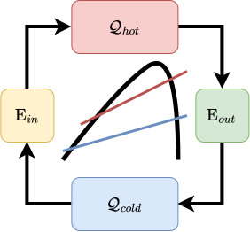
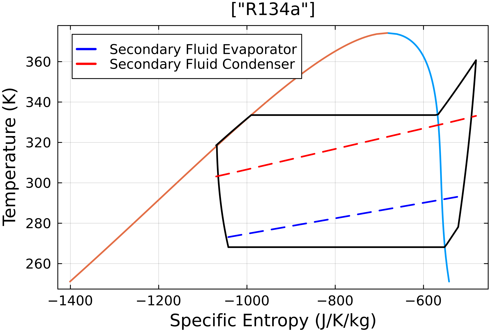

# Carnot.jl

[](https://github.com/ClapeyronThermo/Carnot.jl/actions/workflows/CI.yml?query=branch%3Amain) [](https://clapeyronthermo.github.io/Carnot.jl/dev/)


<p align="center">
  <picture>
    <source media="(prefers-color-scheme: dark)" srcset="docs/src/assets/logo_dark.svg">
    <source media="(prefers-color-scheme: light)" srcset="docs/src/assets/logo.svg">
    
  </picture>
</p>


This package aims to solve Heat Pump and ORC systems for given known temperature glides. For now it is robust for sub-critical cycles. 

The thermodynamic computations use Clapeyron.jl. 

# Installation
For the latest release, first type `]` and then:

```julia
pkg> add Carnot
```

For the developer version type:

```julia
pkg> add https://github.com/ClapeyronThermo/Carnot.jl
```

# Usage
Usage Heat Pump Example :

```julia
 using Clapeyron, Carnot

 fluid = cPR(["R134a"],idealmodel = ReidIdeal);

 η_comp = 0.75; pp_cond = 5; pp_evap = 5;

 T_evap_in = 273.15 + 20; T_evap_out = 273.15 + 0; 
 
 T_cond_in = 273.15 + 30;  T_cond_out = 273.15+60;

 ΔT_sc = 15; ΔT_sh = 10;

 hp = HeatPump(fluid=fluid,z=[1.0],
                T_evap_in=T_evap_in,T_evap_out = T_evap_out,
                T_cond_in = T_cond_in,T_cond_out=T_cond_out,
                η_comp=η_comp,
                pp_evap=pp_evap,pp_cond=pp_cond,
                ΔT_sc = ΔT_sc,ΔT_sh = ΔT_sh);

```

To solve do the following:

```julia
julia>  sol_hp = solve(hp,ThermoCycleParameters(autodiff=false))
SolutionState{Float64, Int64}([2.3994048422328, 16.817386905557985], 20, 4, [5.935589797445573e-10, 3.0524915928253904e-11], [1.6183989368988956, 1.6183989368988956], [26.13980387599181, 26.13980387599181], false, 2, 8.149495449471192e-7, 5.943433628196976e-10, :subcritical)

julia> COP(hp,sol_hp)
-3.445859140654867
```

To plot do the following:

```julia
julia>  using Plots
julia>  default(
                  fontfamily = "DejaVu Sans",
                  guidefontsize = 14,
                  tickfontsize = 11,
                  legendfontsize = 11,
                  titlefontsize = 14,
                  dpi = 500,
                  framestyle = :box
              )
julia>  plot(hp,sol_hp,N = 100)
```




# Limitation

1. Fluid models are limited to the ones provided by default in Clapeyron.jl. Now restricted to `CubicModel` and `SingleFluid` models. 
2. For now the solver is stable for sub-critical parameters. So if incase the solver does not converge please check if the parameters provided allow the solution to be subcritical. 
3. For mixtures, it is recommended to use parameters sufficently below the critical point as sometimes near crictical zone the computation of dew and bubble points can fail.   
4. If for solving with `autodiff = true`, the first run will have significant compilation time. The subsequent runs will be faster.