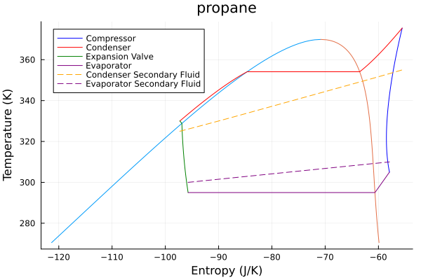

# ThermoCycleGlides

[](https://github.com/Sush1090/ThermoCycleGlides.jl/actions/workflows/CI.yml?query=branch%3Amain)

This package aims to solve Heat Pump and ORC systems for given known temperature glides. For now it is robust for sub-critical cycles. 

The thermodynamic computations use Clapeyron.jl. 

# Usage
Usage Heat Pump Example :

```julia
julia> using Clapeyron, ThermoCycleGlides

julia> fluid = cPR(["cyclopentane"],idealmodel = ReidIdeal);

julia> η_comp = 0.75; pp_cond = 2; pp_evap = 2;

julia> T_evap_in = 273.15 + 10; T_evap_out = 273.15 + 0; T_cond_in = 273.15 + 50;  T_cond_out = 273.15+60;

julia> ΔT_sc = 3; ΔT_sh = 10;

julia> hp = HeatPump(fluid=fluid,z=[1.0],T_evap_in=T_evap_in,T_evap_out = T_evap_out,T_cond_in = T_cond_in,T_cond_out=T_cond_out,η_comp=η_comp,pp_evap=pp_evap,pp_cond=pp_cond,ΔT_sc = ΔT_sc,ΔT_sh = ΔT_sh);

julia> sol_hp, res_hp = solve(hp) # res_hp is the pinchpoint temperture residue.
([0.12829257763187563, 1.4440205301792532], [0.0, -4.6397769835948566e-5])
 
julia> COP(hp,sol_hp) # Computes COP of Heat pump
-3.7495668569405063
```

To plot do the following;

```julia
plot_cycle(hp,sol_hp,p_min=0.3*sol_hp[1]*101325,N = 1000)
```


ORC Example:

```julia
julia> orc = ORC(fluid = fluid,z = [1.0], T_evap_in = 360, T_evap_out = 340, T_cond_in = 280, T_cond_out = 290, η_expander = 0.75, η_pump = 0.8, ΔT_sh = 7.0, ΔT_sc= 3.0, pp_evap = 3.0, pp_cond = 3)
ORC{Float64}(PR{ReidIdeal, TwuAlpha, NoTranslation, vdW1fRule}("Propane"), [1.0], 360.0, 340.0, 7.0, 280.0, 290.0, 3.0, 0.8, 0.75, 3.0, 3.0)

julia> sol,res = solve(orc)
([27.619094241454576, 8.297312696256173], [1.3659347928296484e-6, -3.1898690622256254e-6])

julia> η(orc,sol)
-0.11240385922458294
```

To plot the ORC cycle: 

```julia
julia> plot_cycle(orc,sol,p_min=0.5*sol_hp[2]*101325,N = 1000)
```


# Optimization

One would like to optimize their cycle, i.e. for a HP get the most optimal super and sub cooling temperatures. 
Hence here we use the solver of Optim on a HP to optimize our solution. 

```julia
fluid = cPR(["propane"],idealmodel = ReidIdeal); z = [1.0]
T_evap_in = 290.0; T_evap_out = 280.0 ; T_cond_in = 310.0; T_cond_out = 335.0; η_comp = 0.75; pp_evap = 3; pp_cond = 3; 

hp_(x::AbstractVector{T}) where {T<:Real} = HeatPump(fluid= fluid,z= z,T_evap_in= T_evap_in,T_evap_out = T_evap_out,ΔT_sh =  x[1], 
                    T_cond_in = T_cond_in, T_cond_out = T_cond_out, ΔT_sc = x[2], η_comp = η_comp, pp_evap = pp_evap, pp_cond = pp_cond)


function obj_hp(x::AbstractVector{T}) where {T<:Real}
    @assert length(x) == 2 "x must be a vector of length 2, ΔT_sh and ΔT_sc"
    hp = hp_(x)
    sol,_ = solve(hp, N = 20)

    return COP(hp, sol)
end


using Optim, LineSearches
lower = [0.1,0.1]
upper = [30.0,30.0] 
x0 = [4.0,4.0]
inner_optimizer = LBFGS(linesearch = LineSearches.BackTracking(c_1 = 1e-5,ρ_hi = 1.0))
opts = Optim.Options(x_abstol = 1e-5,time_limit = 20.0,iterations = 50,outer_iterations = 50)
println("Starting optimization for HP...")
@time results_optim = Optim.optimize(obj_hp, lower, upper, x0, Fminbox(inner_optimizer),autodiff = :forward,opts)
```


Result: 

```julia
julia> @time results_optim = Optim.optimize(obj_hp, lower, upper, x0, Fminbox(inner_optimizer),autodiff = :forward,opts)
  9.236083 seconds (9.70 M allocations: 404.902 MiB, 0.34% gc time, 0.86% compilation time: 85% of which was recompilation)
 * Status: success

 * Candidate solution
    Final objective value:     -4.147180e+00

 * Found with
    Algorithm:     Fminbox with L-BFGS

 * Convergence measures
    |x - x'|               = 1.10e-13 ≤ 1.0e-05
    |x - x'|/|x'|          = 5.23e-15 ≰ 0.0e+00
    |f(x) - f(x')|         = 0.00e+00 ≤ 0.0e+00
    |f(x) - f(x')|/|f(x')| = 0.00e+00 ≤ 0.0e+00
    |g(x)|                 = 3.44e-02 ≰ 1.0e-08

 * Work counters
    Seconds run:   9  (vs limit 20)
    Iterations:    18
    f(x) calls:    665
    ∇f(x) calls:   216
```

To plot the optimized cycle:

```julia
julia> hp_opt = hp_(results_optim.minimizer);

julia> sol_opt,res_opt = solve(hp_opt)
([5.392105645334067, 21.648328278563845], [5.684341886080802e-14, -0.0011278209551619511])

julia> plot_cycle(hp_opt,sol_opt,p_min=sol_opt[1]*0.5*101325)
```

