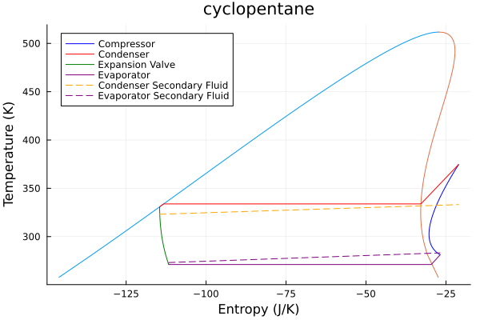

# ThermoCycleGlides

[](https://github.com/Sush1090/ThermoCycleGlides.jl/actions/workflows/CI.yml?query=branch%3Amain)

This package aims to solve Heat Pump and ORC systems for given known temperature glides. 

The thermodynamic computations use Clapeyron.jl. 

Usage Example :

```julia
julia> using Clapeyron, ThermoCycleGlides

julia> fluid = cPR(["cyclopentane"],idealmodel = ReidIdeal);

julia> η_comp = 0.75; pp_cond = 2; pp_evap = 2;

julia> T_evap_in = 273.15 + 10; T_evap_out = 273.15 + 0; T_cond_in = 273.15 + 50;  T_cond_out = 273.15+60;

julia> ΔT_sc = 3; ΔT_sh = 10;

julia> hp = HeatPump(fluid=fluid,z=[1.0],T_evap_in=T_evap_in,T_evap_out = T_evap_out,T_cond_in = T_cond_in,T_cond_out=T_cond_out,η_comp=η_comp,pp_evap=pp_evap,pp_cond=pp_cond,ΔT_sc = ΔT_sc,ΔT_sh = ΔT_sh);

julia> sol_hp, res_hp = solve(hp) # res_hp is the pinchpoint temperture residue.
([0.12829257763187563, 1.4440205301792532], [0.0, -4.6397769835948566e-5])
 
julia> COP(hp,sol_hp) # Computes COP of Heat pump
-3.7495668569405063
```

To plot do the following;

```julia
plot_cycle(hp,sol_hp,p_min=0.3*sol_hp[1]*101325,N = 1000)
```

