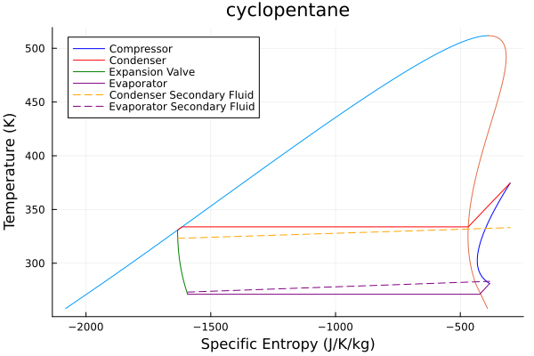
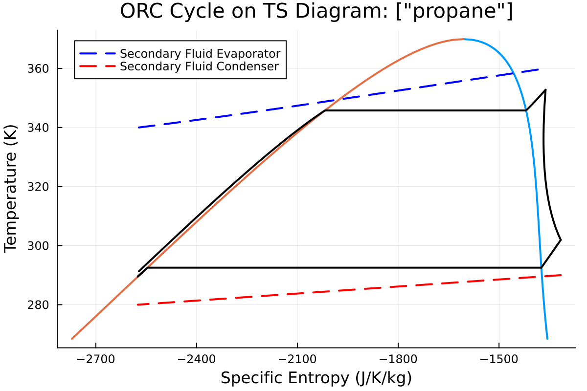
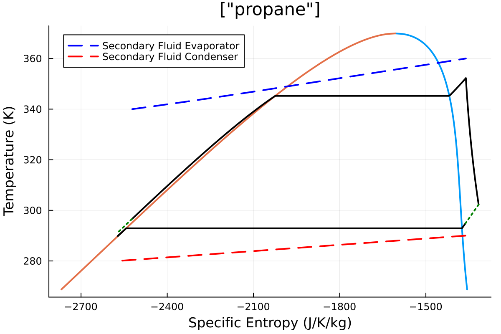

# Examples

These examples show how to construct the system with parameters and how to solve it.

**Note** In all examples `z` denotes the number of moles, for mixtures ensure `length(z)` is same as the number of fluid components. 

## Heat Pump
The goal of a heat pump is to heat up the secondary fluid of the condenser with some input of energy. See [Heat pump and Refrigeration cycle](https://en.wikipedia.org/wiki/Heat_pump_and_refrigeration_cycle).


To construct the system, do the following:
```julia
julia> using Clapeyron, ThermoCycleGlides

julia> fluid = cPR(["cyclopentane"],idealmodel = ReidIdeal);

julia> η_comp = 0.75; pp_cond = 2; pp_evap = 2;

julia> T_evap_in = 273.15 + 10; T_evap_out = 273.15 + 0; T_cond_in = 273.15 + 50;  T_cond_out = 273.15+60;

julia> ΔT_sc = 3; ΔT_sh = 10;

julia> hp = HeatPump(fluid=fluid,z=[1.0],T_evap_in=T_evap_in,T_evap_out = T_evap_out,T_cond_in = T_cond_in,T_cond_out=T_cond_out,η_comp=η_comp,pp_evap=pp_evap,pp_cond=pp_cond,ΔT_sc = ΔT_sc,ΔT_sh = ΔT_sh);

julia> sol_hp = solve(hp)
SolutionState{Float64, Int64}([0.12829257763187535, 1.4551588056895837], 16, 7, [0.0, 5.684341886080802e-14], [0.07660159441435545, 0.07660159441435545], [1.6566058479359296, 1.6566058479359296], true, 0, 2.5468671054250572e-15, 8.038873388460929e-14)
 
julia> COP(hp,sol_hp)
-3.735868783526992
```
*Note:* `COP` is [Coefficient of Performance](https://en.wikipedia.org/wiki/Coefficient_of_performance) of the Heat Pump, it is negative as we see change of enthalpy of the working fluid which is negative in the condenser.


To plot do the following:

```julia
plot_cycle(hp,sol_hp,N=300)
```




## Heat Pump with IHEX

Now the same heatpump with an internal heat exchanger of effectiveness ($\epsilon$) of `0.7` can be constructed as follows:


```julia
julia> hp_ihex = HeatPumpRecuperator(hp=hp,ϵ=0.7);

julia> sol_ihex = solve(hp_ihex)
SolutionState{Float64, Int64}([0.12829257763131544, 1.4173574009406653], 8, 4, [3.524291969370097e-12, 8.827782949083485e-11], [0.07660159441435545, 0.07660159441435545], [1.6566058479359296, 1.6566058479359296], true, 0, 2.9326582172085184e-7, 8.83481511606116e-11, :subcritical)

julia> COP(hp_ihex,sol_ihex)
-3.8122385181795906
```


## Organic Rankine Cycle
An Organic Rankine Cycle aims to generate electricity from heating the working fluid, and passing it through an expander. See [Organic Rankine Cycle](https://en.wikipedia.org/wiki/Organic_Rankine_cycle) for more information.


```julia
julia> fluid = cPR(["propane"],idealmodel = ReidIdeal);

julia> orc = ORC(fluid = fluid,z = [1.0], T_evap_in = 360, T_evap_out = 340, T_cond_in = 280, T_cond_out = 290, η_expander = 0.75, η_pump = 0.8, ΔT_sh = 7.0, ΔT_sc= 3.0, pp_evap = 3.0, pp_cond = 3)
ORC{Float64}(PR{ReidIdeal, TwuAlpha, NoTranslation, vdW1fRule}("Propane"), [1.0], 360.0, 340.0, 7.0, 280.0, 290.0, 3.0, 0.8, 0.75, 3.0, 3.0)

julia> sol = solve(orc,ThermoCycleParameters())
SolutionState{Float64, Int64}([27.24650730390755, 8.310317972863196], 6, 3, [1.943476490851026e-10, -2.1819346329721157e-8], [19.921551772573725, 6.969208543698516], [29.511108921525086, 9.094386318669063], true, 0, 1.1554874341578823e-5, 2.1820211851973873e-8, :subcritical)

julia> η(orc,sol)
-0.08885630488485266
```

*Note:* Here, the efficiency is also negative as there is an enthalpy drop of the working fluid in the expander while there is an enthalpy gain in the evaporator. 

To plot the ORC cycle: 

```julia
julia> plot_cycle(orc,sol,N=300)
```


## Organic Rankine Cycle with IHEX
As for the heatpump we now construct the ORC with internal heat exchanger. 


```julia
julia> orc_ihex = ORCEconomizer(orc=orc,ϵ=0.7);

julia> sol_ihex = solve(orc_ihex,ThermoCycleParameters())
SolutionState{Float64, Int64}([26.973845637899313, 8.391221086633655], 6, 3, [3.3583091862965375e-10, -3.281326144133345e-8], [19.921551772573725, 6.969208543698516], [29.511108921525086, 9.094386318669063], true, 0, 1.4417396042634078e-5, 3.2814979945494535e-8, :subcritical)

julia> η(orc_ihex,sol_ihex)
-0.09082835333090268
```


# Plotting 
To plot the cycle use the following API: 

```julia
plot_cycle(prob::ThermoCycleProblem,sol::SolutionState,N=100)
```