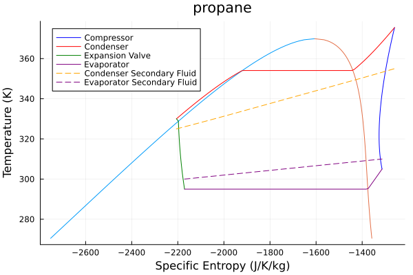

# Optimization

Cycle optimization is integrated with Metaheuristics.jl. The goal of the inbuilt optimization is to find optimal superheating and subcooling temperatures for a given cycle. 

Here an example of `HeatPump` is shown.

We set our `HeatPump`
```julia
using Clapeyron, ThermoCycleGlides,Metaheuristics

fluid = cPR("propane",idealmodel = ReidIdeal)
hp = HeatPump(fluid=fluid, z=[1.0], T_evap_in=310, T_evap_out=300.0, T_cond_in=325, T_cond_out=355, η_comp=0.75, pp_evap=5, pp_cond=5, ΔT_sc=5.0, ΔT_sh=5.0)
```

We load the algorithm and its parameters from [Metaheuristics.jl](https://github.com/jmejia8/Metaheuristics.jl):
```julia
options = Metaheuristics.Options(f_tol_rel = 1e-2, f_tol = 1e-2,f_calls_limit = 1000,parallel_evaluation = false,verbose = true)

algo = ECA(options = options)
```


We optimize the system
```julia
result,hp_optimized = ThermoCycleGlides.optimize(hp,algo; autodiff = true,N = 20,lower = 2.0,tol = 1e-3)
```

```julia
+-----------+------------+------------+------------+------------+
| Iteration | Num. Evals |   Minimum  |    Time    | Converged  |
+-----------+------------+------------+------------+------------+
|         1 |         14 | -3.2777e+00 |   0.1310 s |         No |
|         2 |         28 | -3.2777e+00 |   0.2390 s |         No | 
|         3 |         42 | -3.6478e+00 |   0.3530 s |         No | 
|         4 |         56 | -3.6478e+00 |   0.4640 s |         No | 
|         5 |         70 | -3.6715e+00 |   0.5840 s |         No | 
|         6 |         84 | -4.0781e+00 |   0.7110 s |         No | 
|         7 |         98 | -4.0781e+00 |   0.8110 s |         No | 
|         8 |        112 | -4.0781e+00 |   0.9100 s |         No | 
|         9 |        126 | -4.0781e+00 |   1.0160 s |         No | 
|        10 |        140 | -4.0917e+00 |   1.1300 s |         No | 
|        11 |        154 | -4.0917e+00 |   1.2640 s |         No | 
|        12 |        168 | -4.0998e+00 |   1.3900 s |         No | 
|        13 |        182 | -4.1010e+00 |   1.5340 s |         No | 
|        14 |        196 | -4.1019e+00 |   1.6970 s |         No | 
|        15 |        210 | -4.1019e+00 |   1.8340 s |         No | 
|        16 |        224 | -4.1268e+00 |   1.9640 s |         No | 
|        17 |        238 | -4.1268e+00 |   2.1000 s |         No | 
|        18 |        252 | -4.1273e+00 |   2.2320 s |         No | 
|        19 |        266 | -4.1273e+00 |   2.3570 s |         No | 
|        20 |        280 | -4.1373e+00 |   2.4660 s |         No | 
|        21 |        294 | -4.1373e+00 |   2.5780 s |         No | 
|        22 |        308 | -4.1391e+00 |   2.6700 s |         No | 
|        23 |        322 | -4.1396e+00 |   2.7720 s |         No | 
|        24 |        336 | -4.1396e+00 |   2.8680 s |         No | 
|        25 |        350 | -4.1406e+00 |   2.9700 s |         No | 
|        26 |        364 | -4.1406e+00 |   3.0870 s |         No | 
|        27 |        378 | -4.1406e+00 |   3.1900 s |         No | 
|        28 |        392 | -4.1407e+00 |   3.2880 s |         No | 
|        29 |        406 | -4.1408e+00 |   3.3750 s |         No | 
|        30 |        420 | -4.1408e+00 |   3.4640 s |         No | 
|        31 |        434 | -4.1408e+00 |   3.5480 s |         No | 
|        32 |        448 | -4.1408e+00 |   3.6400 s |         No | 
|        33 |        462 | -4.1408e+00 |   3.7350 s |         No | 
|        34 |        476 | -4.1409e+00 |   3.8430 s |         No | 
|        35 |        490 | -4.1409e+00 |   3.9330 s |         No | 
|        36 |        504 | -4.1409e+00 |   4.0190 s |         No | 
|        37 |        518 | -4.1409e+00 |   4.0990 s |         No | 
|        38 |        532 | -4.1409e+00 |   4.1870 s |         No | 
|        39 |        546 | -4.1409e+00 |   4.2770 s |         No | 
|        40 |        560 | -4.1409e+00 |   4.3780 s |         No | 
|        41 |        574 | -4.1409e+00 |   4.4790 s |         No | 
|        42 |        588 | -4.1409e+00 |   4.5830 s |         No | 
|        43 |        602 | -4.1409e+00 |   4.6910 s |         No | 
|        44 |        616 | -4.1409e+00 |   4.7910 s |         No | 
|        45 |        630 | -4.1409e+00 |   4.9250 s |         No | 
|        46 |        644 | -4.1409e+00 |   5.0420 s |         No | 
|        47 |        658 | -4.1409e+00 |   5.1370 s |         No | 
|        48 |        672 | -4.1409e+00 |   5.2410 s |         No | 
|        49 |        686 | -4.1409e+00 |   5.3260 s |         No | 
|        50 |        700 | -4.1409e+00 |   5.4270 s |         No | 
|        51 |        714 | -4.1409e+00 |   5.5190 s |         No | 
|        52 |        728 | -4.1409e+00 |   5.6230 s |         No | 
|        53 |        742 | -4.1409e+00 |   5.7060 s |         No | 
|        54 |        756 | -4.1409e+00 |   5.7910 s |         No | 
|        55 |        770 | -4.1409e+00 |   5.8850 s |         No | 
|        56 |        784 | -4.1409e+00 |   5.9860 s |         No | 
|        57 |        798 | -4.1409e+00 |   6.0820 s |         No | 
|        58 |        812 | -4.1409e+00 |   6.1680 s |         No | 
|        59 |        826 | -4.1409e+00 |   6.2600 s |         No | 
|        60 |        840 | -4.1409e+00 |   6.3610 s |         No | 
|        61 |        854 | -4.1409e+00 |   6.4660 s |         No | 
|        62 |        868 | -4.1409e+00 |   6.5540 s |         No | 
|        63 |        882 | -4.1409e+00 |   6.6350 s |         No | 
|        64 |        896 | -4.1409e+00 |   6.7290 s |         No | 
|        65 |        910 | -4.1409e+00 |   6.8210 s |         No | 
|        66 |        924 | -4.1409e+00 |   6.9100 s |        Yes | 
(Optimization Result
===================
  Iteration:       66
  Minimum:         -4.14088
  Minimizer:       [10.0, 24.0863]
  Function calls:  924
  Total time:      6.9100 s
  Stop reason:     Due to Convergence Termination criterion.
```

To plot the cycle we do as before but now the optimized cycle is already returned by the `optimize` function - `hp_optimized`

**Note:** This is a metaheuristic method hence the converged answer for the user for this case can slighty be different based on number of function calls , time, solution etc ..

```julia
sol = solve(hp_optimized,autodiff = true,N = 20,xtol = 1e-6,ftol = 1e-6,max_iter= 1000);
plot_cycle(hp_optimized,sol;N = 300)
```


